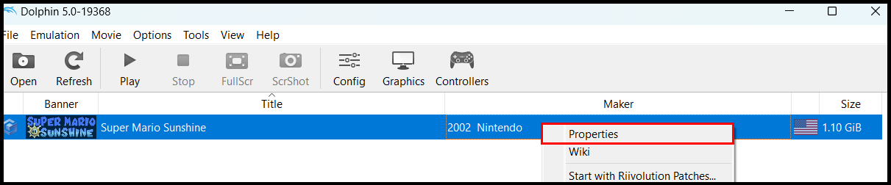

# Super Mario Sunshine but you lose health every 10 seconds #
- [How To Setup](#How-To-Setup)
  - [Preparations](#Preparations)
  - [Adding the Code](#Adding-the-Code)
- [Inspirations for the Challenge](#Inspirations-for-the-Challenge)
  - [Video Inspirations](#Video-Inspirations)
  - [How I got the Gecko Code](#How-I-got-the-Gecko-Code)
- [My Main Video of the Challenge](#My-Main-Video-of-the-Challenge)

 

# How To Setup # 
This is a Guide on how to setup the Challenge on an Emulator on Windows.

  - Notes:
    - The Code doesn't work on water surface
    - The Code only works in the US Version of the Game

## Preparations ##
To get this to work you need the following thing already set up:
* Super Mario Sunshine (US Version) --> I can't tell you where to get that
* The Dolphin Emulator setup to play the Game: https://dolphin-emu.org/

## Adding the Code ##
After having the game and emulator set up, right click on the game, follow these steps:

1. Right click on the game and click on "Properties":  

2. Click on "Gecko Codes":  

3. Click on "Add New Code":  

4. Add the following Code:  
0424EE58 38000000  

 

# Inspirations for the Challenge #
This is how I was inspired to try out this Challenge.

## Video Inspirations ##
I saw a Video of a type of this Challenge in Super Mario 64 by Simply:

 Mod Creator: https://www.youtube.com/@KazeN64

Because something like this hasn't been done before in Super Mario Sunshine I wanted to try something similar in that game. I think that a lot of Challenges differ very much depending on the game they are played in, so I thought it would be interesting.

## How I got the Gecko Code ##
While trying to find a Gecko Code (Basically a Cheat Code) or Mod for this Challenge I found the following:  
https://gamebanana.com/mods/14812  
Credit: Muzzarino

The problem with this Code was, that it always gets you into a Game Over once you die. I tried to edit the Code and found out, that when you only use the first line of the Gecko Code, what I wanted still works but without getting you a Game Over each time you die.

 

# My Main Video of the Challenge #

